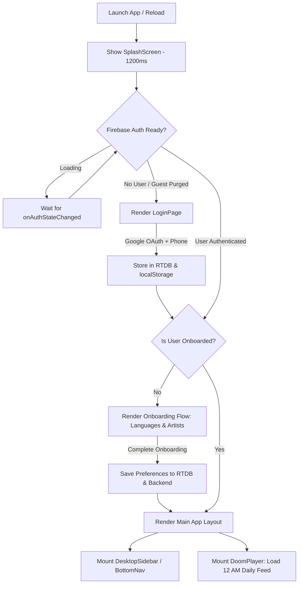
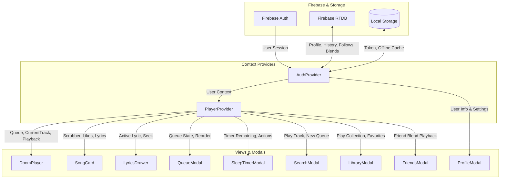

# 🎧 Staytup Music — Frontend Documentation & Architecture

Welcome to the comprehensive documentation for the **Staytup Music** frontend client. Staytup is a modern, high-fidelity music streaming Progressive Web Application (PWA) built with a responsive Spotify-style layout featuring persistent desktop and mobile navigation, synchronized lyrics, rich artist and album discovery, intelligent sleep timers, queue management, and real-time social features.

---

## 📋 Table of Contents

1. [Overview & Tech Stack](#-overview--tech-stack)
2. [Project Structure](#-project-structure)
3. [Application Lifecycle & Flow](#-application-lifecycle--flow)
4. [What Works & How It Works](#-what-works--how-it-works)
   - [1. Authentication & Onboarding Flow](#1-authentication--onboarding-flow)
   - [2. Spotify-Style Responsive Shell & Navigation](#2-spotify-style-responsive-shell--navigation)
   - [3. Audio Playback & MediaSession Engine](#3-audio-playback--mediasession-engine)
   - [4. Docked Miniplayer & Full-Screen Player](#4-docked-miniplayer--full-screen-player)
   - [5. Synchronized Lyrics Drawer](#5-synchronized-lyrics-drawer)
   - [6. Queue Management System](#6-queue-management-system)
   - [7. Sleep Timer System](#7-sleep-timer-system)
   - [8. Search & Discovery Engine](#8-search--discovery-engine)
   - [9. Library, Playlists & Community](#9-library-playlists--community)
   - [10. Friends, Real-Time Presence & Taste Blend](#10-friends-real-time-presence--taste-blend)
   - [11. Artist & Album Explorer Pages](#11-artist--album-explorer-pages)
   - [12. PWA & Service Worker Caching](#12-pwa--service-worker-caching)
5. [State Management Architecture](#-state-management-architecture)
6. [API Client & Firebase Integration](#-api-client--firebase-integration)
7. [Design System & Styling](#-design-system--styling)
8. [Setup & Running Locally](#-setup--running-locally)

---

## ⚡ Overview & Tech Stack

The frontend is engineered as a responsive single-page application (SPA) following the modern Spotify desktop and mobile design system with persistent navigation, responsive grids, and full-width fluid layouts.

- **Framework**: [React 18](https://react.dev/) (`18.3.1`)
- **Build Tool**: [Vite 6](https://vitejs.dev/) with `@vitejs/plugin-react`
- **Styling**: [Tailwind CSS 3](https://tailwindcss.com/) (`3.4.17`), custom animations, custom colors (`brand`), and `postcss`
- **Icons**: [Lucide React](https://lucide.dev/) (`0.475.0`) & Flaticon UIcons
- **Authentication**: [Firebase Auth](https://firebase.google.com/docs/auth) (Google OAuth popup)
- **Realtime Database**: [Firebase Realtime Database](https://firebase.google.com/docs/database) (Profiles, Community history, Live Presence, Daily feeds, Followed artists, Social Blends)
- **Audio Engine**: Native HTML5 `Audio` API + W3C [MediaSession API](https://developer.mozilla.org/en-US/docs/Web/API/Media_Session_API)
- **Effects & UI**: `canvas-confetti` for like animations
- **PWA**: Service Worker (`sw.js`) with Cache-first for static assets and Network-first for navigation, `manifest.webmanifest` for standalone installation on iOS and Android

---

## 📂 Project Structure

```text
staytup/
├── index.html                   # HTML entry point, Google fonts (Poppins), PWA meta tags
├── vite.config.js               # Vite config, dev proxy to PHP backend (/api)
├── tailwind.config.js           # Brand color tokens, typography & shadow overrides
├── package.json                 # Dependencies and npm scripts
├── public/
│   ├── sw.js                    # Service Worker caching logic
│   ├── manifest.webmanifest     # PWA standalone manifest configuration
│   └── assets/                  # Logos, icons, and Memoji avatars
└── src/
    ├── main.jsx                 # App entry point, React root, SW registration
    ├── index.css                # Global Tailwind directives, scroll-snap & marquee styles
    ├── App.jsx                  # Root container, auth guard, view coordinator & modals
    ├── api/
    │   ├── client.js            # Fetch wrapper, dynamic subfolder/Vite base URL detection
    │   └── endpoints.js         # API interface for all backend endpoints
    ├── context/
    │   ├── AuthContext.jsx       # Firebase Google Auth, onboarding, profile synchronization
    │   └── PlayerContext.jsx     # Master audio playback engine, queue, lyrics, sleep timer
    ├── services/
    │   ├── firebase.js          # Firebase app init, RTDB getters/setters, presence & history
    │   └── dailyFeedService.js  # 12 AM daily feed generation, shuffle & infinite replenishment
    ├── utils/
    │   └── media.js             # 500x500 artwork resolution upscaler & canvas color extractor
    └── components/
        ├── SplashScreen.jsx     # Initial app launch splash animation
        ├── LoginPage.jsx        # Google OAuth login + optional contact number prompt
        ├── Onboarding.jsx       # Language selection & favorite artist picker
        ├── DoomPlayer.jsx       # Fullscreen vertical scroll-snap feed (Reels-style)
        ├── SongCard.jsx         # Individual track card (artwork, marquee, scrubber, actions)
        ├── MarqueeText.jsx      # Auto-scrolling text marquee for lengthy titles
        ├── LyricsDrawer.jsx     # Synchronized LRCLIB timestamped lyrics with auto-scroll
        ├── QueueModal.jsx       # Fullscreen reorderable queue and upcoming tracks
        ├── SleepTimerModal.jsx  # Countdown & end-of-track sleep timer modal
        ├── SearchModal.jsx      # Multi-tab search with live suggestions & categories
        ├── LibraryModal.jsx     # Favorites, custom playlists, followed artists, history
        ├── FriendsModal.jsx     # Social friends list, user search, requests & Taste Blend
        ├── ProfileModal.jsx     # User settings, listening stats, toggles & legal
        ├── LoginModal.jsx       # Edit profile modal (username & Memoji avatar picker)
        ├── SongDetailsModal.jsx # "..." bottom action sheet for any track
        ├── ArtistSheet.jsx      # Artist discography, biography, follower count & follow toggle
        ├── AlbumSheet.jsx       # Album/Playlist tracklist sheet with playback controls
        ├── PlaylistSheet.jsx    # Add track to existing or newly created playlist
        ├── BottomNav.jsx        # Mobile bottom navigation bar (For You, Search, Library, etc.)
        └── DesktopSidebar.jsx   # Desktop persistent side navigation bar
```

---

## 🔄 Application Lifecycle & Flow

When the user launches Staytup, the application evaluates state in three progressive tiers before displaying the main interface:



1. **Splash Screen**: Displays the Staytup brand logo with a smooth fade-out.
2. **Authentication Guard**: Guest/unauthenticated sessions are strictly purged on boot. Users must sign in via Google OAuth.
3. **Onboarding Guard**: Checks if the user has selected languages and at least 3 favorite artists. If not, the step-by-step onboarding flow is presented.
4. **Main View Mounted**:
   - `DoomPlayer` loads or restores today's daily feed.
   - Global modals and drawers (`LyricsDrawer`, `QueueModal`, `SleepTimerModal`, etc.) are mounted once at the root level and controlled via Context or state.

---

## 💡 What Works & How It Works

### 1. Authentication & Onboarding Flow
- **Files**: `src/context/AuthContext.jsx`, `src/components/LoginPage.jsx`, `src/components/Onboarding.jsx`, `src/services/firebase.js`
- **How it works**:
  - **Google OAuth**: `signInWithGoogle()` triggers a Firebase popup. When authorized, the user's UID, email, and display name are captured.
  - **Profile Synchronization**: The app attempts to fetch an existing profile from Firebase Realtime Database (`users/{uid}/profile`). If absent, it creates a new record and mirrors it to the PHP backend via `api.onboardUser()`.
  - **Phone Number Step**: Step 2 of `LoginPage` offers an optional phone number prompt so friends can find each other for Social Blends.
  - **Onboarding Step 1 (Languages)**: User selects their preferred music languages (Hindi, Punjabi, English, Tamil, Telugu, Bhojpuri, etc.).
  - **Onboarding Step 2 (Artists)**: Dynamically fetches popular artists matching the selected languages using `api.getPopularArtists()`. Images are auto-hydrated via batch image resolution.
  - **Avatar Customization**: Users can pick from 10 high-resolution Memoji avatars in `LoginModal.jsx`.

---

### 2. The DoomPlayer Vertical Feed Engine
- **Files**: `src/components/DoomPlayer.jsx`, `src/components/SongCard.jsx`, `src/services/dailyFeedService.js`
- **How it works**:
  - **Vertical CSS Snap Container**: Uses `.snap-feed` (`scroll-snap-type: y mandatory`) and `.snap-card` (`scroll-snap-align: start`, `scroll-snap-stop: always`) for an instant, Reels/TikTok-like scrolling experience.
  - **Dual Snap Detection**:
    1. **IntersectionObserver**: Configured with a `threshold: 0.7` to instantly identify which card is currently taking up the majority of the viewport.
    2. **Debounced Scroll Handler**: Calculates `Math.round(scrollTop / clientHeight)` to settle cleanly on the target index.
  - **Daily 12:00 AM Personalized Mix**:
    - Aggregates the user's followed artists, recently played artists, and onboarding favorites.
    - Fetches top tracks for up to 6 selected artists in parallel using their artist catalog IDs.
    - Interleaves tracks across artists to guarantee variety (no artist plays two songs back-to-back).
    - Shuffles the collection using Fisher-Yates and saves it under `staytup_daily_feed_YYYY-MM-DD` in both `localStorage` and Firebase RTDB.
  - **Midnight Auto-Refresh**: An interval checks every 60 seconds (and on window focus) if the local date exceeds the stored feed date. When passing 12:00 AM midnight, it automatically regenerates the daily feed without requiring a manual page refresh.
  - **Infinite Replenishment**: When `currentIndex >= queue.length - 3`, `replenishInfiniteDailyQueue()` dynamically pulls more tracks based on recent listening habits and appends them to the queue without interrupting playback.
  - **Dynamic Home Header**: Displays a time-sensitive greeting ("Good Morning", "Good Afternoon", "Good Evening", "Late Night Vibes") alongside an animated 4-bar equalizer that beats while audio plays.

---

### 3. Audio Playback & MediaSession Engine
- **Files**: `src/context/PlayerContext.jsx`, `src/utils/media.js`
- **How it works**:
  - **HTML5 Audio Pipeline**: Managed through a single persistent `Audio` ref (`audioRef.current`).
  - **Stream Resolution & Decryption**: Calls `api.getStreamUrl(videoId)`. The backend decrypts JioSaavn's media URL using 3DES/DES-ECB and returns an unexpired 320kbps/160kbps MP4/AAC stream URL.
  - **Stream Cache**: Stream URLs are cached in an in-memory `Map` (`streamCache`) to prevent duplicate network calls when looping or re-visiting tracks.
  - **Race Condition Guard (`activeTrackLoadIdRef`)**:
    - Every time a track switch is initiated, an internal counter `activeTrackLoadIdRef.current` increments.
    - If a user rapidly scrolls past 3 songs, any in-flight asynchronous stream resolution requests from earlier songs are immediately discarded upon completion. Only the song matching the latest ID is allowed to play.
  - **Autoplay Handling**: If modern browser autoplay policy rejects an unmuted `.play()` promise, the player automatically registers temporary one-time listeners on `click`, `touchstart`, and `keydown` to resume playback on the user's very first gesture.
  - **W3C MediaSession Integration**:
    - Registers metadata (`title`, `artist`, `album`, and 500x500 high-definition artwork).
    - Hooks system action handlers: `play`, `pause`, `previoustrack`, `nexttrack`, and `seekto`.
    - Allows full background control from lock screens, Apple Watch, AirPods, and Android media notification panels.
  - **Listening Analytics & Community Tracking**:
    - Once `currentTime > 1` second, the track is marked as listened.
    - Records the play to:
      1. Local PHP API: `/play/record`
      2. Firebase RTDB: `users/{uid}/history/{trackId}`
      3. Global Community Feed: `community/history/{trackId}`
      4. Live Presence: `presence/{uid}` ("Listening now" status)
      5. `localStorage`: `staytup_recently_played` for instant offline access.

---

### 4. SongCard & UI Presentation
- **Files**: `src/components/SongCard.jsx`, `src/components/MarqueeText.jsx`, `src/utils/media.js`
- **How it works**:
  - **Ambient Glow Background**: The current album art is enlarged, blurred (`blur-3xl`), and set to a low opacity behind a dark gradient overlay.
  - **500x500 HD Artwork**: Artwork URLs are sanitized via `get500x500Image()` to replace low-res thumbnail prefixes (`/150x150/`, `/250x250/`) with full-resolution 500x500 assets.
  - **Centered Play/Pause Indicator**: Tapping anywhere on the artwork toggles playback. When playing, the overlay automatically scales down and becomes transparent for an unobstructed view of the cover art.
  - **Fixed-Height Layout**: The synced lyric preview pill occupies a fixed-height row (`h-7`). Whether lyrics exist or not, the album cover and controls never jump or shift vertically.
  - **Marquee Text**: For song titles or artist credits exceeding display widths, `MarqueeText` smoothly scrolls the text horizontally with pause-on-hover.
  - **Multi-Artist Picker**:
    - Artists are parsed by splitting strings across `,`, `&`, `|`, and `feat.`.
    - If a track has multiple artists (e.g., "Arijit Singh, Shreya Ghoshal & Pritam"), clicking the artist label opens a picker modal with individual circular avatars. Clicking any artist opens their specific `ArtistSheet`.
  - **Like Button with Confetti**: Clicking the heart toggles favorite status and fires a multi-color particle burst powered by `canvas-confetti` originating from the button's exact viewport coordinates.
  - **Scrubber Bar**: Full-width progress bar supporting direct tap-to-seek with real-time formatted elapsed and total duration displays.

---

### 5. Synchronized Lyrics Drawer
- **Files**: `src/components/LyricsDrawer.jsx`, `src/context/PlayerContext.jsx`
- **How it works**:
  - Fetches lyrics from the backend via `api.getLyrics(title, artist, videoId)`, resolving synchronized timestamped `.lrc` lyrics from LRCLIB or JioSaavn.
  - **Real-Time Highlighting**: In `PlayerContext`, a `timeupdate` listener searches `lyrics.synced_lyrics` for the last line where `currentTime >= line.time` and updates `activeLyricIndex`.
  - **Smooth Auto-Centering**: Whenever `activeLyricIndex` changes, `activeLineRef.current.scrollIntoView({ behavior: 'smooth', block: 'center' })` keeps the current singing line centered on screen.
  - **Tap-to-Seek**: Tapping any lyrics line triggers `seek(line.time)`, instantly jumping playback to that exact lyric phrase.
  - **Fallback Modes**: If timestamped lyrics are unavailable, plain-text lyrics are rendered. If no lyrics exist, an elegant instrumental placeholder is displayed.

---

### 6. Queue Management System
- **Files**: `src/components/QueueModal.jsx`, `src/context/PlayerContext.jsx`
- **How it works**:
  - **Now Playing Display**: Highlights the active song with an animated live equalizer wave, track duration, and play/pause controls.
  - **Up-Next Queue List**: Displays all upcoming tracks in sequence.
  - **Reordering**: Users can reorder tracks up or down using the `ChevronUp` and `ChevronDown` controls.
  - **Track Removal**: Swipe or click to remove any track from the queue (`removeFromQueue`).
  - **Clear Queue**: Clears all upcoming songs while preserving the currently playing track.
  - **Autoplay / Load More**: Clicking "Load More to Queue" fetches additional tracks using `replenishInfiniteDailyQueue()` and appends them without restarting the current stream.

---

### 7. Sleep Timer System
- **Files**: `src/components/SleepTimerModal.jsx`, `src/context/PlayerContext.jsx`
- **How it works**:
  - **Preset Options**: Offers 5 min, 15 min, 30 min, 45 min, 1 hour, 2 hours, and "End of track".
  - **Countdown Interval**: If a time duration is chosen, a 1-second interval counts down `sleepTimerRemaining`. Upon reaching zero, playback is cleanly paused, and the timer mode resets.
  - **End of Track Mode**: When selected, sets `sleepTimerEndOfTrackRef.current = true`. When the active track dispatches the HTML5 `ended` event, playback halts instead of advancing to `nextTrack()`.
  - **Live Header Badge**: The top bar of `DoomPlayer` dynamically displays an active pulsing badge with the remaining minutes or "End of song".

---

### 8. Search & Discovery Engine
- **Files**: `src/components/SearchModal.jsx`, `src/api/endpoints.js`
- **How it works**:
  - **Debounced Live Autocomplete**: As the user types, a 180ms debounced request hits `api.getSuggestions(query)` to populate instant keyword suggestions.
  - **Quick Trending Tags**: One-tap pills for trending artists and genres (e.g., "Arijit Singh", "Romantic Hits", "Chill Lo-Fi", "Punjabi Hits").
  - **Browse Categories**: Curated tiles for Bollywood, Punjabi, Romantic, Lo-Fi & Chill, Party & Dance, and Indie Pop.
  - **Categorized Tabs**: Organizes search results into:
    - **All**: Mixed overview of top matches, tracks, artists, and albums.
    - **Songs**: Exhaustive tracklist with direct play and more-options triggers.
    - **Artists**: Circular artist avatars with monthly listener counts; opens `ArtistSheet`.
    - **Albums**: Album cards with year and track count; supports instant one-tap album playback.
    - **Playlists**: Curated playlist results.
  - **Search History**: Tracks played from search are stored in `staytup_search_played` in `localStorage` for immediate recall.

---

### 9. Library, Playlists & Community
- **Files**: `src/components/LibraryModal.jsx`, `src/components/PlaylistSheet.jsx`
- **How it works**:
  - **Tab 1: Favorites**: Shows all tracks liked by the user. Supports one-tap "Shuffle Play" of all favorites and individual track removal.
  - **Tab 2: Playlists**:
    - Lists custom user-created playlists.
    - "New Playlist" modal to create playlists with a custom title and description.
    - "Add to Playlist" sheet (`PlaylistSheet`) allows adding any active track to an existing playlist or creating a new one on the fly.
    - Spotify Playlist Import: Supports pasting public Spotify playlist URLs; the backend scrapes and imports the full tracklist into the user's library.
  - **Tab 3: Artists**: Displays all artists the user has followed. Missing artist portraits are automatically hydrated via `api.getBatchArtistImages()`.
  - **Tab 4: Community**:
    - **Public Playlists**: Community-shared playlists published by other Staytup listeners.
    - **Live Community History**: Aggregates tracks currently being played by all active listeners across the world via Firebase RTDB (`community/history`).
  - **Tab 5: History & Analytics**:
    - Shows recently played tracks with timestamps.
    - Displays listening analytics: Total songs played, top artist, and active listening streak.
    - Resilient 3-tier fallback architecture: Local PHP API ➔ Firebase Realtime Database ➔ LocalStorage.

---

### 10. Friends, Real-Time Presence & Taste Blend
- **Files**: `src/components/FriendsModal.jsx`, `src/services/firebase.js`
- **How it works**:
  - **Live Presence**: When a user plays music, `recordTrackHistoryToFirebase()` updates `presence/{uid}` with their active song title, artist, and timestamp. Friends can see what each other are playing in real time.
  - **User Search & Requests**: Users can search for other registered listeners by username or phone number (debounced 300ms) and send friend requests.
  - **Friend Request Management**: Dedicated tabs to view, accept, or decline incoming friend requests.
  - **Taste Blend**: Creates a collaborative 50/50 taste blend playlist between two friends by merging their top-played tracks and favorite artists into a shared mix in Firebase (`blends/{uid1_uid2}`).

---

### 11. Artist & Album Explorer Sheets
- **Files**: `src/components/ArtistSheet.jsx`, `src/components/AlbumSheet.jsx`
- **How it works**:
  - **Artist Sheet**:
    - Queries `api.getArtistInfo()` and `api.getArtistSongs()`.
    - Renders artist banner, verified badge, formatted listener count ("38.4M+"), and clean parsed biography.
    - Follow / Unfollow toggle button that updates `localStorage` and dispatches a `staytup_followed_artists_updated` custom event to re-render all dependent components.
    - Top Tracks list with one-tap playback.
  - **Album Sheet**:
    - Queries `api.getAlbum()` or `api.getPlaylist()`.
    - Features large album cover, release year, track count, and duration.
    - "Play All" and "Shuffle" buttons that load the full album into the active queue.

---

### 12. PWA & Service Worker Caching
- **Files**: `public/sw.js`, `index.html`, `public/manifest.webmanifest`
- **How it works**:
  - **App Shell Cache**: Pre-caches `./index.html`, `./logo.png`, and `./manifest.webmanifest` on install.
  - **Selective Media Bypass**: The service worker explicitly excludes audio stream URLs, range requests, and external media CDNs (`saavncdn`, `googlevideo`) from cache storage to avoid memory exhaustion and preserve media streaming bandwidth.
  - **Cache-First Static Strategy**: Serves JS bundles, CSS, icons, and fonts directly from Cache Storage for fast offline launches.
  - **Network-First Navigation Strategy**: Ensures the user always receives the freshest HTML document on reload.
  - **iOS Safari Standalone**: Includes `apple-mobile-web-app-capable`, `apple-mobile-web-app-status-bar-style: black-translucent`, and custom Apple Touch Icons.

---

## 🏛 State Management Architecture



### Context Breakdown:
- **`AuthContext`**:
  - State: `user`, `isOnboarded`, `isLoadingAuth`
  - Methods: `loginWithGoogle()`, `finalizeGoogleLogin()`, `completeOnboarding()`, `login()`, `logout()`
- **`PlayerContext`**:
  - State: `queue`, `currentIndex`, `currentTrack`, `isPlaying`, `currentTime`, `duration`, `volume`, `isMuted`, `isLoadingStream`, `streamError`, `likedTrackIds`, `lyrics`, `activeLyricIndex`, `sleepTimerMode`, `sleepTimerRemaining`
  - Methods: `playTrack()`, `jumpToIndex()`, `togglePlay()`, `nextTrack()`, `prevTrack()`, `seek()`, `toggleLike()`, `removeFromQueue()`, `addToQueueNext()`, `reorderQueue()`, `clearQueue()`, `setSleepTimer()`, `cancelSleepTimer()`

---

## 🌐 API Client & Firebase Integration

### 1. API Client (`src/api/client.js`)
The API client intelligently auto-detects whether it is running under Vite development mode (`localhost:5173`) or in an Apache deployment subfolder (e.g., `/staytup/`):
```javascript
const getApiBase = () => {
  if (window.location.pathname.includes('/staytup')) {
    return '/staytup/api';
  }
  return '/api';
};
```
Every outgoing request automatically includes standard headers:
- `Accept: application/json`
- `X-User-Id: <user_id>` (read from `localStorage`)
- `Content-Type: application/json` (for POST/PUT requests)

### 2. Firebase Schema Overview
```text
staytupnow-default-rtdb/
├── users/
│   └── {userId}/
│       ├── profile/              # username, displayName, email, avatar, languages, favoriteArtists, phone
│       ├── history/              # {trackId}: {videoId, title, artist, album, image, playedAt}
│       ├── followedArtists/      # [{name, id, image, followedAt}]
│       ├── favorites/            # [videoId, videoId, ...]
│       └── dailyFeeds/
│           └── {YYYY-MM-DD}/     # {date, generatedAt, tracks: [...]}
├── community/
│   └── history/
│       └── {trackId}/            # Global recent tracks {title, artist, lastPlayedBy, lastPlayedAt}
├── presence/
│   └── {userId}/                 # {status, trackTitle, trackArtist, timestamp}
└── blends/
    └── {user1_user2}/            # {users: [...], tracks: [...], updatedAt}
```

---

## 🎨 Design System & Styling

- **Color Palette (`tailwind.config.js`)**:
  - `brand.black`: `#000000` (Pure AMOLED black background)
  - `brand.surface`: `#121212` (Elevated modals and drawers)
  - `brand.card`: `#1C1C1E` (Card background)
  - `brand.cardHover`: `#252528` (Interactive hover state)
  - `brand.border`: `#2C2C2E` (Subtle boundary borders)
  - `brand.muted`: `#8E8E93` (Secondary text / labels)
  - `brand.white`: `#FFFFFF` (Primary text & active highlights)
- **Typography**: Poppins (`weights: 300, 400, 500, 600, 700, 800`), font smoothing enabled.
- **Scroll Behavior**:
  - `.no-scrollbar`: Hides scrollbars across WebKit, Firefox, IE, and Edge.
  - `.snap-feed`: Vertical scroll snapping with momentum scrolling on touch devices.
- **Animations**:
  - `animate-marquee`: Infinite smooth horizontal text scroll.
  - `animate-music-bar-1` to `4`: 4-phase equalizer wave bar animation.

---

## 🚀 Setup & Running Locally

### Prerequisites
- Node.js 18+ and npm
- Local web server (e.g. XAMPP, Apache, or Nginx) running the PHP backend at `http://localhost/staytup/api`

### 1. Install Dependencies
```bash
npm install
```

### 2. Run in Development Mode
Starts Vite dev server on port `5173` with proxy to the backend API:
```bash
npm run dev
```
Open [http://localhost:5173](http://localhost:5173) in your browser.

### 3. Build for Production
Compiles optimized assets into the `dist/` folder:
```bash
npm run build
```

### 4. Preview Production Build
```bash
npm run preview
```

---

## 📄 Backend Documentation
For complete backend REST API endpoints, decryption algorithms, and data structures, refer to [api/README.md](file:///Applications/XAMPP/xamppfiles/htdocs/staytup/api/README.md).
